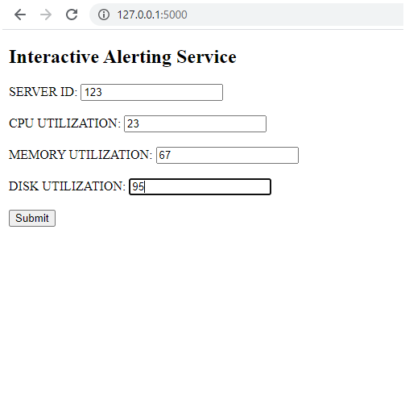
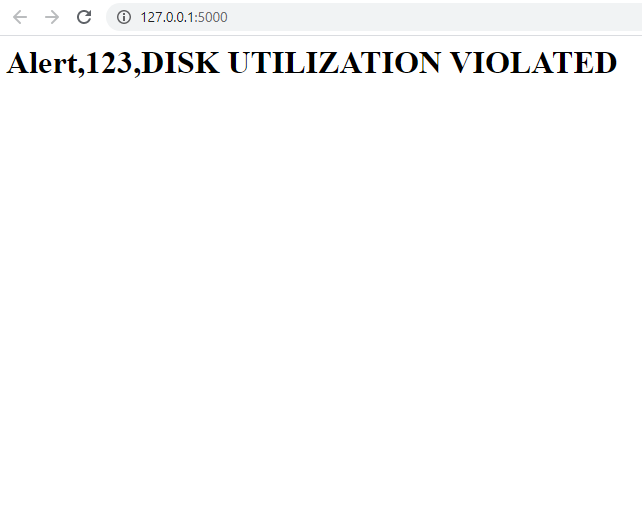

# Alerting Service

app.py is the root file which contains class named Alert.Driver functions carries all logical operations for desired output. 

This file aldready has virtual env created, so no need of any installations. Follow the given codes to execute. 

-->Activate virtual environment -name of virtual environment is flask_env {code for windows> flask_env\Scripts\activate} . 
-->run the code {code> flask run}  

If the above steps are not working then follow the steps mentioned below 

Installation Steps 

->Install flask {code for windows> pip install flask} 

->run the code {code> flask run} 

Unit tests: 

->Run test.py file for unit tests (code> python test.py)

(Note:Make sure you are in the path of directory)

### Form where you need to fill details

### Result

